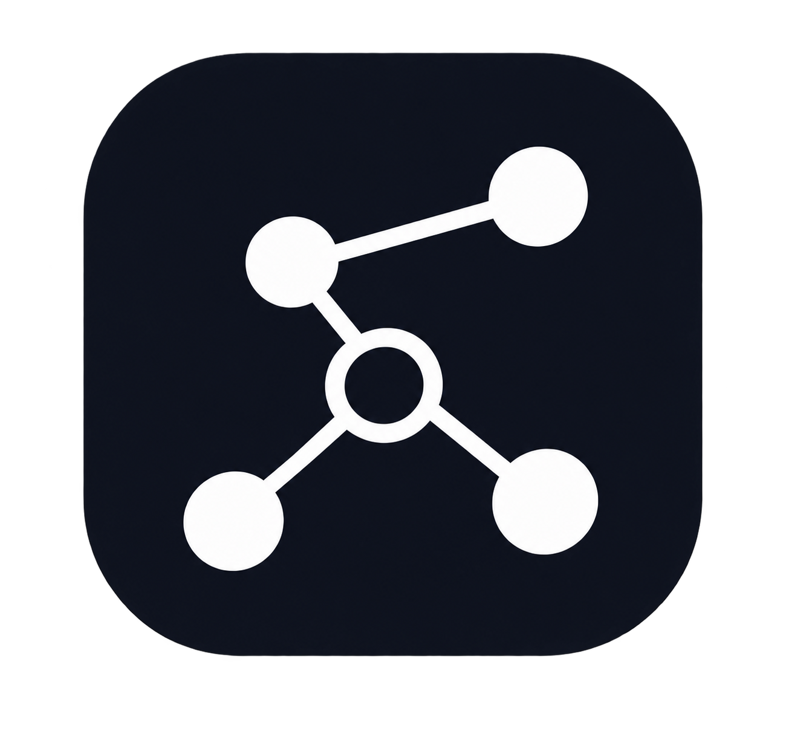
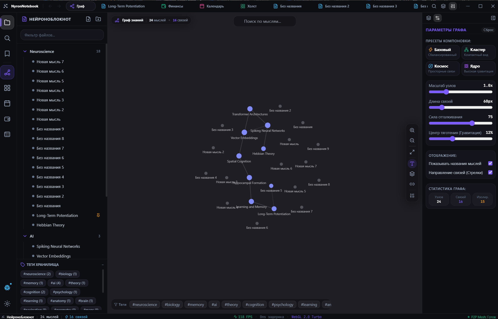
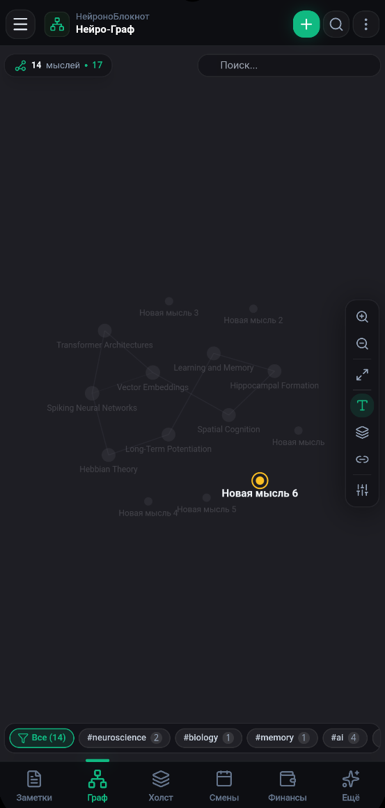

<div align="center">



# NyronNotebook

**Персональный цифровой мозг, 3D/2D граф знаний, планировщик рабочих смен и финансовый менеджер**

<p align="center">
  
  
  
  
  
  
  
  
</p>

*Кроссплатформенная экосистема: **Windows** • **Android** • **Linux** • **macOS** • **iOS***

</div>

---

> [!CAUTION]
> ### 🛑 ВНИМАНИЕ: ОСТЕРЕГАЙТЕСЬ ФЕЙКОВ / FAKE CLONES!
>
> Я не веду никакие другие страницы/группы в Telegram или каналы на YouTube. Если вы наткнулись на файлы, сборки или архивы в сети вне этой официальной страницы GitHub, распространяемые от моего лица — это **ФЕЙК**.
>
> Загружайте и используйте программу **исключительно** из проверенного официального репозитория автора: **[github.com/hellmorvin](https://github.com/hellmorvin)**. Другие источники могут содержать вредоносные скрипты и вирусы, ворующие персональные данные.

---

## ◈ Скриншоты Интерфейса / Interface Showcase

<div align="center">
  <table>
    <thead>
      <tr style="background: rgba(255, 255, 255, 0.05);">
        <th align="center" width="64%"><b>◈ ДЕСКТОПНЫЙ КЛИЕНТ (WINDOWS / MACOS / LINUX)</b></th>
        <th align="center" width="36%"><b>◈ МОБИЛЬНЫЙ КЛИЕНТ (ANDROID / IOS)</b></th>
      </tr>
    </thead>
    <tbody>
      <tr>
        <td align="center" valign="top">
          <a href="./scrinshot/2.png" target="_blank">
            
          </a>
          <br/>
          <sub>✦ <i>3D/2D Нейро-Граф • Настройки физики • Дерево файлов • Система тегов</i></sub>
        </td>
        <td align="center" valign="top">
          <a href="./scrinshot/1.png" target="_blank">
            
          </a>
          <br/>
          <sub>✦ <i>Сенсорный граф • Быстрый поиск • Нижняя навигация • P2P Sync</i></sub>
        </td>
      </tr>
    </tbody>
  </table>
</div>

---

## ◈ Загрузка и Установка (Releases v1.0.0)

Официальные сборки доступны на странице **[GitHub Releases v1.0.0](https://github.com/hellmorvin/NyronNetbook/releases/tag/v1.0.0)**:

| Платформа | Формат | Прямая ссылка | Назначение |
| :--- | :--- | :--- | :--- |
| **Windows 10 / 11** | `.exe` (Portable) | **[Скачать для Windows](https://github.com/hellmorvin/NyronNetbook/releases/download/v1.0.0/NyronNotebook-1.0.0.exe)** | Автономный запуск без установки (x64) |
| **Android** | `.apk` (Signed) | **[Скачать NyronNotebook.apk](https://github.com/hellmorvin/NyronNetbook/releases/download/v1.0.0/NyronNotebook.apk)** | Полнофункциональный мобильный клиент (8.0 - 15+) |
| **Linux** | `.AppImage` / `.deb` | **[Скачать для Linux](https://github.com/hellmorvin/NyronNetbook/releases/tag/v1.0.0)** | Ubuntu, Debian, Fedora, Arch Linux |
| **macOS** | `.dmg` / `.zip` | **[Скачать для macOS](https://github.com/hellmorvin/NyronNetbook/releases/tag/v1.0.0)** | Apple Silicon (M1-M4) и Intel x64 |
| **iOS (Apple)** | `Xcode Workspace` | **[Исходный проект iOS](https://github.com/hellmorvin/NyronNetbook/tree/main/packages/mobile/ios)** | Проект для компиляции в Xcode для iPhone / iPad |

---

## ❖ Архитектурные Модули

### ◈ 1. Интерактивный 3D/2D Нейро-Граф
- Трехмерная и двухмерная визуализация связей на базе **Three.js** и **d3-force**.
- Автоматическое выявление синапсов через двусторонние вики-ссылки `[[Имя заметки]]`.
- **4 физических пресета компоновки:**
  - ✦ **Базовый:** сбалансированная гравитация и упругость связей.
  - ✦ **Кластер:** компактная группировка по тегам и смысловым категориям.
  - ✦ **Космос:** просторная галактическая структура для объемных баз знаний.
  - ✦ **Ядро:** плотная визуализация вокруг центральных концептов.
- **Режим «Паук» (Spider-Mode):** мгновенная изоляция активного узла и его окружения.

### ◈ 2. Универсальный Редактор Знаний
- **Obsidian Markdown:** мгновенный предпросмотр, математические формулы, списки задач и подсветка кода.
- **Word Ribbon Bar:** классическая панель форматирования шрифтов, стилей заголовков и выравнивания.
- **Excel-Style Таблицы:** интерактивная работа с табличными данными и формулами подсчета сумм.
- Система тегов, двусторонних ссылок, прикрепления метаданных и цветового кодирования.

### ◈ 3. Календарь Рабочих Смен и Расписание
- Генератор сменных циклов: **2/2**, **3/3**, **5/2**, **1/3**, **1/2** или произвольный шаблон.
- Автоматический расчет заработной платы с учетом дневных/ночных ставок и премиальных.
- Трекер личных дел, тренировок, стрижек, обслуживания авто с привязкой к конкретным датам.

### ◈ 4. Финансовый Менеджер и Калькулятор Вкладов
- Учет доходов и расходов по категориям с наглядными интерактивными графиками распределения бюджета.
- Калькулятор банковских вкладов и накопительных счетов с **ежемесячной капитализацией процентов**.
- Постановка и отслеживание прогресса финансовых целей и накоплений.

### ◈ 5. Защищенное P2P Сопряжение (Offline-First)
- Прямая синхронизация между телефоном и компьютером без сторонних серверов.
- **Секретный закрытый токен (Pairing PIN):** любые другие устройства в той же сети Wi-Fi изолированы и не могут перехватить данные.
- 100% данных хранится только на ваших личных устройствах.

---

## ❖ Таблица Горячих Клавиш

| Комбинация | Действие |
| :--- | :--- |
| `Ctrl + N` / `Cmd + N` | Создать новую заметку |
| `Ctrl + O` / `Cmd + O` | Быстрое переключение заметок (Quick Switcher) |
| `Ctrl + F` / `Cmd + F` | Полнотекстовый и фонетический поиск |
| `Ctrl + G` / `Cmd + G` | Переключить режим 2D / 3D Графа |
| `Ctrl + B` / `Cmd + B` | Скрыть / Показать боковое дерево файлов |
| `Ctrl + S` / `Cmd + S` | Сохранить активную заметку |
| `Ctrl + W` / `Cmd + W` | Закрыть текущую вкладку |
| `Ctrl + ,` / `Cmd + ,` | Меню настроек и тем оформления |

---

## ❖ Сборка и Разработка из Исходников

```bash
# 1. Клонировать репозиторий
git clone https://github.com/hellmorvin/NyronNetbook.git
cd NyronNetbook

# 2. Установить зависимости monorepo
npm install

# 3. Запустить десктопную версию для разработки
npm run desktop:app

# 4. Сборка готовых пакетов:
npm run build:desktop:win   # Windows Portable EXE и ZIP (папка release/)
npm run build:apk           # Подписанный Android APK (папка release/)
```

---

## ❖ Лицензия

Проект распространяется под открытой лицензией **MIT License**. Подробнее см. файл [LICENSE](LICENSE).

<div align="center">
  <sub>Разработано для продуктивности и свободы мышления <b>NyronNotebook</b> © 2026. Автор: <a href="https://github.com/hellmorvin">@hellmorvin</a></sub>
</div>
