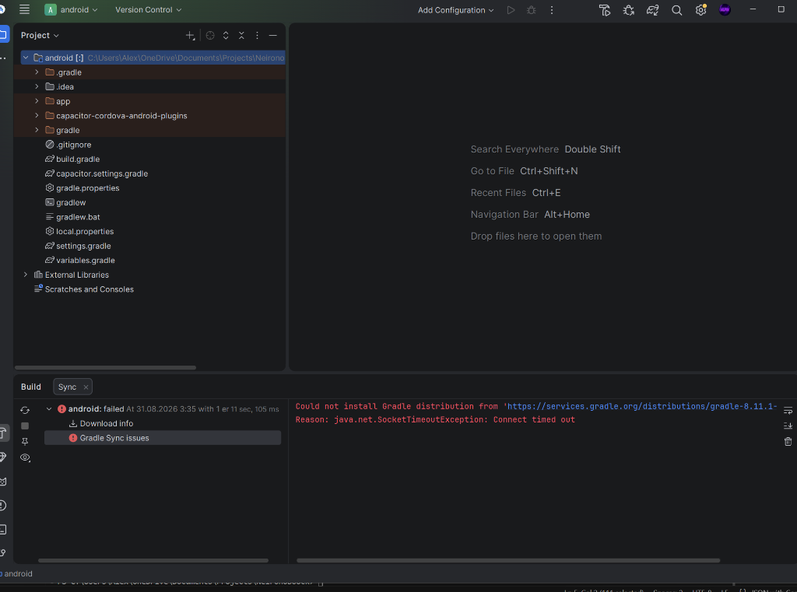
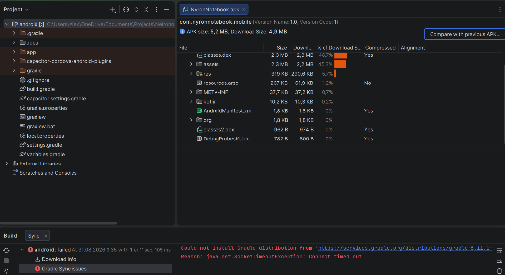
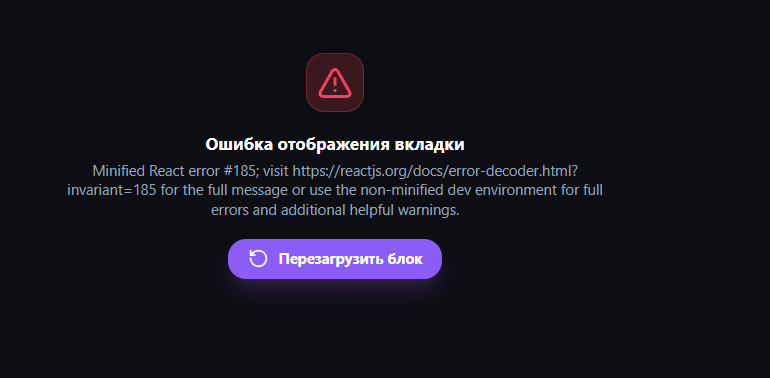
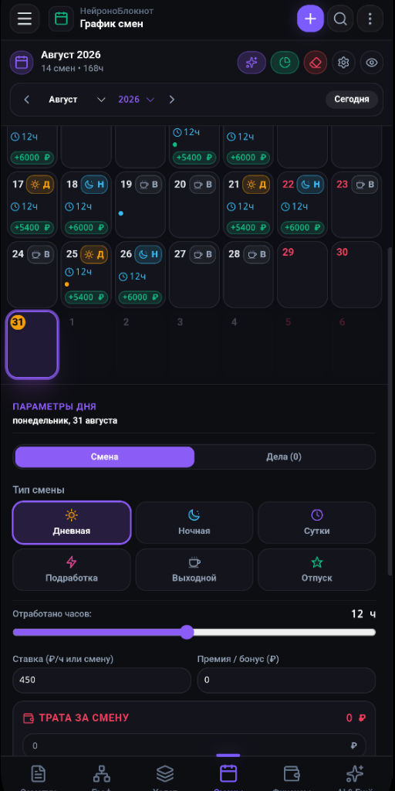
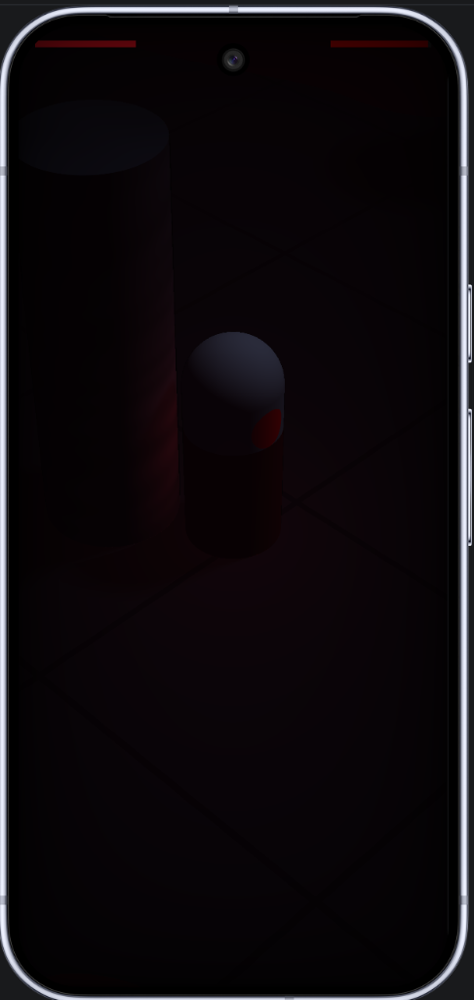

<div align="center">


# NyronNotebook 🧠

**Ваш персональный цифровой мозг, интерактивный граф знаний, умный планировщик смен и финансовый трекер**

<p align="center">
  
  
  
  
  
  
  
  
</p>

*Поддержка платформ: **Windows** • **Linux** • **macOS (Apple)** • **Android** • **iOS***

</div>

---

> [!CAUTION]
> ### 🛑 ВНИМАНИЕ: ОСТЕРЕГАЙТЕСЬ ФЕЙКОВ / FAKE CLONES!
>
> Я не веду никакие другие страницы/группы в Telegram или каналы на YouTube. Если вы наткнулись на файлы, сборки или архивы в сети вне этой официальной страницы GitHub, распространяемые от моего лица — это **ФЕЙК**.
>
> Загружайте и используйте программу **исключительно** из проверенного официального репозитория автора: **[github.com/hellmorvin](https://github.com/hellmorvin)**. Другие источники могут содержать вредоносные скрипты и вирусы, ворующие персональные данные.

---

## 📥 Загрузка и Установка (Releases v1.0.0)

Скачивайте готовые установщики со страницы **[GitHub Releases v1.0.0](https://github.com/hellmorvin/NyronNetbook/releases/tag/v1.0.0)**:

| Платформа | Формат пакета | Прямая ссылка на скачивание | Описание |
| :--- | :--- | :--- | :--- |
| 🪟 **Windows** | `.exe` (Portable / Setup) | **[Скачать для Windows](https://github.com/hellmorvin/NyronNetbook/releases/download/v1.0.0/NyronNotebook-1.0.0.exe)** | Автономный запуск Windows 10/11 x64 без установки |
| 📱 **Android** | `.apk` (Release Signed) | **[Скачать NyronNotebook.apk](https://github.com/hellmorvin/NyronNetbook/releases/download/v1.0.0/NyronNotebook.apk)** | Полнофункциональный APK (Android 8.0 - 15+) |
| 🐧 **Linux** | `.AppImage` / `.deb` | **[Скачать для Linux](https://github.com/hellmorvin/NyronNetbook/releases/tag/v1.0.0)** | Универсальный пакет для Ubuntu, Debian, Fedora, Arch |
| 🍏 **macOS** | `.dmg` / `.zip` | **[Скачать для macOS](https://github.com/hellmorvin/NyronNetbook/releases/tag/v1.0.0)** | Поддержка Apple Silicon (M1-M4) и Intel x64 |
| 🍎 **iOS (Apple)** | `Xcode Workspace` | **[Сборка iOS](https://github.com/hellmorvin/NyronNetbook/tree/main/packages/mobile/ios)** | Проект Xcode для iPhone и iPad |

---

## 📷 Скриншоты работы / Preview

<div align="center">

| 🌌 3D / 2D Нейро-Граф Знаний | 📝 Живой Markdown / Word Редактор | 📅 График Смен и Расчет Дохода |
| :---: | :---: | :---: |
|  |  |  |
| **Интерактивный синаптический граф** | **Вики-ссылки `[[Связи]]` и таблицы** | **Расчет почасовой ставки и смен 2/2, 3/3** |

| 💰 Финансовый Менеджер и Вклады | 📱 Мобильный Граф (Android) | 📱 Мобильный Финансовый Трекер |
| :---: | :---: | :---: |
|  |  |  |
| **Капитализация процентов и бюджет** | **Сенсорный граф и быстрые мысли** | **Учет расходов и целей на ходу** |

</div>

---

## ✨ Ключевые Возможности

### 1. 🌌 3D/2D Интерактивный Нейро-Граф Знаний
- Трехмерная и двухмерная визуализация мыслей на движке **Three.js** и **Force-Directed Graph**.
- Автоматическое выявление связей через двусторонние вики-ссылки `[[Имя заметки]]`.
- 4 физических пресета компоновки: **Базовый (⚡)**, **Кластер (🌐)**, **Космос (🪐)**, **Ядро (⚛️)**.
- Режим «Паук» (Spider-Mode) для изоляции активных узлов и их окружения.

### 2. 📝 Мультирежимный Редактор Мыслей
- **Obsidian Markdown** редактор с мгновенным парсингом и подсветкой синтаксиса.
- **Word-Style Ribbon** панель форматирования с заголовками, списками и цитатами.
- **Excel-Style интерактивные таблицы** с вычислениями сумм и формулами.
- Поддержка тегов, закладок, метаданных (Frontmatter) и цветового кодирования.

### 3. 📅 Календарь Рабочих Смен и Событий
- Генератор сменных графиков в один клик: **2/2**, **3/3**, **5/2**, **1/3**, **1/2** или **произвольный цикл**.
- Автоматический расчет заработной платы, ночных надбавок и итогового заработка за месяц.
- Календарные события: стрижки, тренировки, ТО, покупки с привязкой к бюджету.

### 4. 💰 Финансовый Менеджер и Учет Вкладов
- Учет доходов и расходов с разбивкой по категориям и интерактивными графиками.
- Калькулятор банковских вкладов и накопительных счетов с **ежемесячной капитализацией процентов**.
- Постановка и отслеживание финансовых целей и подушки безопасности.

### 5. 🔒 Приватная P2P Синхронизация (Zero-Cloud)
- Прямая синхронизация между ПК и Смартфоном по локальной сети Wi-Fi.
- **Персональный закрытый ключ (Pairing PIN):** посторонние устройства в сети изолированы и не могут получить доступ к хранилищу.
- 100% данных хранится только на ваших личных устройствах.

---

## ⌨️ Горячие Клавиши (Shortcuts)

| Сочетание клавиш | Действие |
| :--- | :--- |
| `Ctrl + N` / `Cmd + N` | Создать новую мысль / заметку |
| `Ctrl + O` / `Cmd + O` | Быстрый поиск заметок (Quick Switcher) |
| `Ctrl + F` / `Cmd + F` | Полнотекстовый и фонетический поиск |
| `Ctrl + G` / `Cmd + G` | Переключить режим 2D / 3D Нейро-Графа |
| `Ctrl + B` / `Cmd + B` | Скрыть / Показать боковую панель |
| `Ctrl + S` / `Cmd + S` | Принудительное сохранение заметки |
| `Ctrl + W` / `Cmd + W` | Закрыть активную вкладку |
| `Ctrl + ,` / `Cmd + ,` | Открыть настройки оформления и тем |

---

## 🛠️ Сборка из исходного кода (Build from Source)

### Требования:
- **Node.js**: версии `18.x` или новее
- **npm**: версии `9.x` или новее

### Установка и запуск:
```bash
# 1. Клонировать репозиторий
git clone https://github.com/hellmorvin/NyronNetbook.git
cd NyronNetbook

# 2. Установить зависимости
npm install

# 3. Запустить десктопное приложение для разработки
npm run desktop:app

# 4. Собрать дистрибутивы:
npm run build:desktop:win   # Windows Portable EXE & ZIP
npm run build:apk           # Android Release APK
```

---

## 📜 Лицензия

Проект распространяется под свободной лицензией **MIT License**. См. [LICENSE](LICENSE) для подробностей.

<div align="center">
  <sub>Создано с любовью командой <b>NyronNotebook</b> © 2026. Разработчик: <a href="https://github.com/hellmorvin">@hellmorvin</a></sub>
</div>
